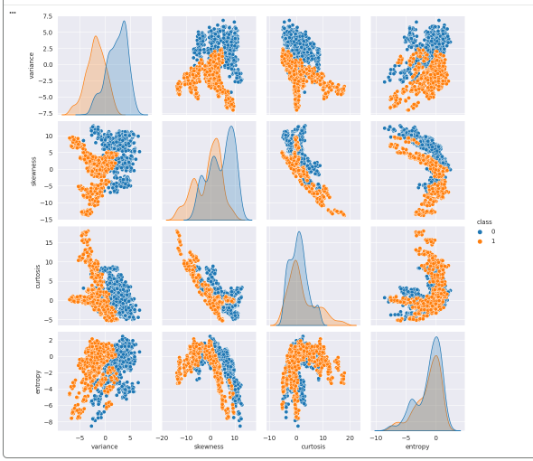
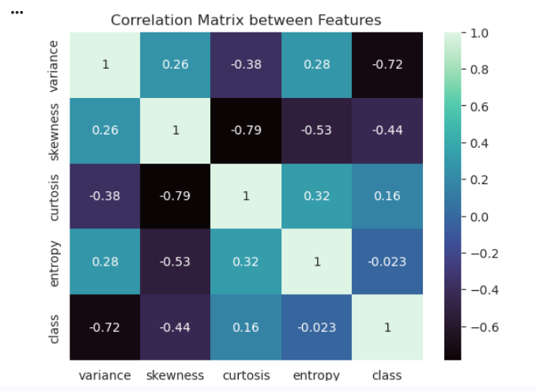
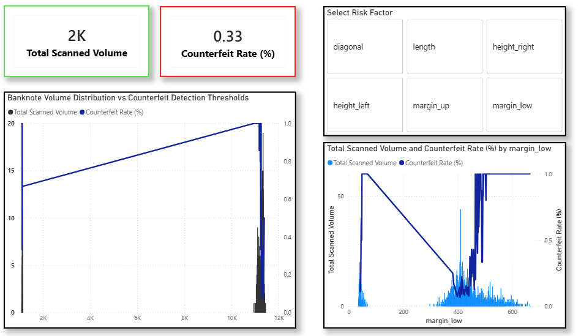
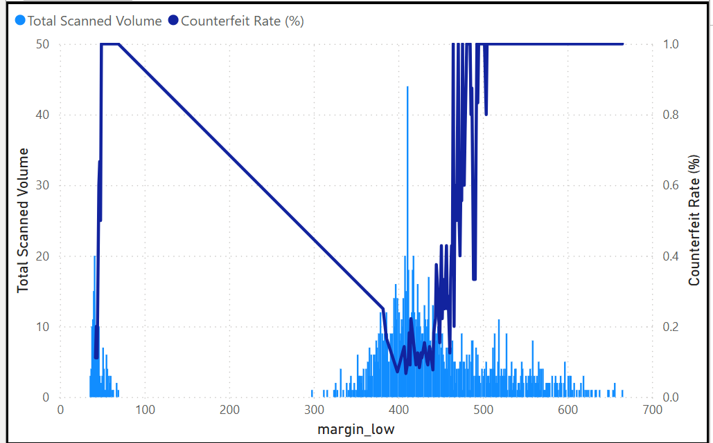

# Bank-Note-Authentication-Indo-

Sebuah proyek deteksi penipuan dan intelijen bisnis komprehensif yang menganalisis dimensi geometris, anomali fisik, dan distribusi uang palsu di berbagai kelompok mata uang yang dipindai.

## Insight Bisnis Utama
- **Deteksi Anomali Geometris:** Memisahkan metrik pengukuran struktural untuk area berisiko tinggi guna melacak karakteristik fisik uang palsu.
- **Penyaringan Fitur Dinamis:** Mengevaluasi varians distribusi struktural secara langsung untuk mengidentifikasi ambang batas operasional puncak dan celah penyimpangan struktural.
- **Pra-pemrosesan Statistik:** Mempertahankan tampilan terperinci dari kerapatan atribut menggunakan plot eksplorasi tingkat lanjut untuk membedakan pemisahan kelas yang sebenarnya.

## Alat yang Digunakan
- **SQL / Python:** Untuk pembersihan dataset, pengisian nilai kosong dinamis (median imputation), dan pembuatan pipa klasifikasi Random Forest.
- **Power BI:** Untuk pemodelan data struktural, membangun skema bidang relasional, dan merender dashboard pemantauan risiko interaktif.

---

## Pratinjau Dashboard & Laporan Operasional

### Bagian 1: Eksplorasi Data Analitik (EDA) Python
Analisis distribusi statistik dasar dan korelasi antar fitur geometris uang kertas yang diekstrak melalui skrip Python.

#### 1. Distribusi Fitur Individu
Melihat histogram dari matriks varians, skewness, kurtosis, dan entropi data.

#### 2. Plot Pasangan Matriks Kelas
Visualisasi sebaran fitur dan pemisahan kelas antara uang asli (0) dan uang palsu (1).

#### 3. Matriks Korelasi Antar Fitur
Peta panas (heatmap) yang menunjukkan kekuatan hubungan linier antar variabel pengukuran.

---

### Bagian 2: Dashboard Interaktif Power BI
Analisis dinamis pelacakan volume pemindaian total, tingkat pemalsuan, dan cross-filtering parameter fisik.

#### 1. Gambaran Umum Dashboard Utama
Kanvas pemantauan penipuan operasional lengkap yang menampilkan volume pemindaian total dan tingkat pemalsuan.

#### 2. Analisis Cross-Filtering Fitur Panjang (Length)
Rincian terperinci yang melacak variasi panjang uang kertas menggunakan pilihan parameter dinamis.

#### 3. Analisis Mendalam Fitur Margin Bawah (Margin Low)
Tampilan fokus yang melacak varians margin lokal yang berada di bawah ambang batas fisik tertentu.

#### 4. Distribusi Volume Fitur Terisolasi
Pelacakan kinerja variabel tunggal strategis yang difokuskan murni pada ambang batas volume target.

---

## Struktur Proyek
- `Clean_Treasury_Bills.csv`: Dataset operasional yang telah dibersihkan untuk transaksi pemindaian mata uang.
- `Bank Note Visualization.pbix`: File laporan Power BI dinamis dengan filter silang aktif dan susunan metrik.
- `README.md`: Dokumentasi teknis proyek dan ringkasan.

## Metrik Utama yang Dilacak
1. **Tingkat Pemalsuan (Counterfeit Rate):** Memantau proporsi uang kertas palsu yang terdeteksi di seluruh total pemindaian.
2. **Total Volume Pemindaian:** Mengevaluasi kepadatan asupan data dan tren pemrosesan batch.
3. **Penyimpangan Struktural Geometris:** Menghitung variasi pada margin, panjang, dan tinggi terhadap target dasar.
